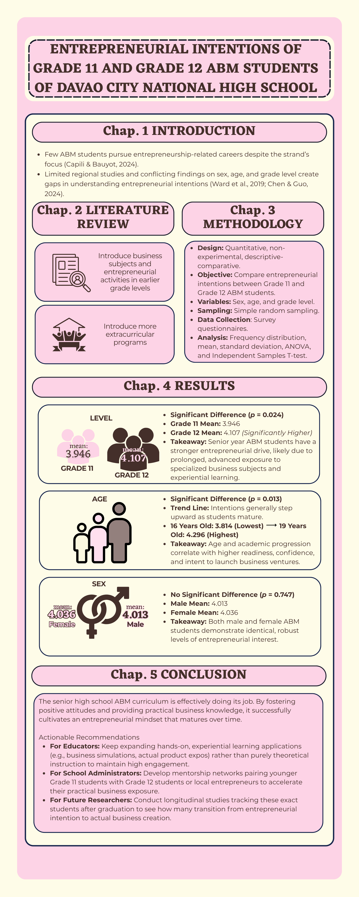

# GE-IT Skills portfolio
# 🌟 Cristdan T. Duro — Professional Portfolio

### *Fueled by passion, driven by purpose.*

---

## 👤 About Me

Hello! I’m **Cristdan T. Duro**. I am a passionate, purpose-driven BSA student entering my second year at Ateneo de Davao University, actively working toward my ultimate goal of becoming a CPA-Lawyer.

In design, I believe that great work is not just about aesthetics—it is about purpose, structure, and impact.

---

## 🖼️ Design Projects

---

### Professional Banner

**Reflection:**
This design uses small arch elements as borders to create a soft yet structured composition. The palette of buttery white, clear pink, and dark gray brown balances warmth and professionalism.

---

### Promotional Post

**Reflection:**
The arches guide the viewer’s attention while maintaining visual harmony. The chosen colors combine softness and depth, making the design both eye-catching and refined.

---

### Infographics

**Reflection:**
This design emphasizes clarity through structured layouts enhanced by subtle arch motifs. The color palette supports readability while maintaining a cohesive and modern aesthetic.

---
## Other Projects

### 🧠 Davao Dengue Prompt System  
🔗 [View Project](https://github.com/cduro30/davao-dengue-prompt-system)

**Reflection:**
This project demonstrates a structured prompt engineering system designed to generate accurate and context-aware outputs related to dengue awareness and data insights in Davao. It focuses on clarity, specificity, and effective communication with AI systems.

---

### 📚 AI Literature Verification

🔗 [View Project](https://github.com/cduro30/ai-literature-verification)

**Reflection:**
This work highlights critical evaluation of AI-generated content through verification and analysis. It emphasizes accuracy, credibility, and responsible AI use.

---

### 📈 Data Analytics Visual Report

🔗 [View Project](https://github.com/cduro30/Data-Analytics-Visual-Report)

**Reflection:**
This project showcases data interpretation and visualization skills. It focuses on transforming raw data into clear, meaningful insights for better decision-making.

---

## 🛠️ Skills & Tools

* 🎨 Graphic Design (Canva, Layout Design)
* 📊 Data Analysis & Visualization
* 🤖 AI Prompt Engineering
* 📑 Research & Documentation
* 💼 Business & Financial Analysis

---

## 📬 Contact Me

* 📧 Email: [cduro@addu.edu.ph](mailto:cduro@addu.edu.ph)
* 🌐 Portfolio Website: ([Cristdan Duro](https://duroprototype.my.canva.site/title))

---

---
